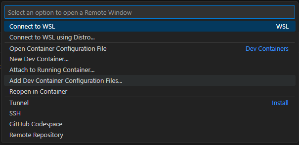
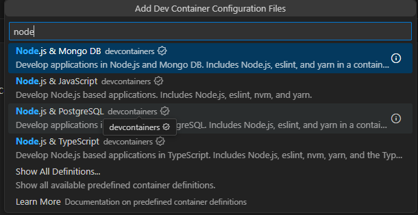
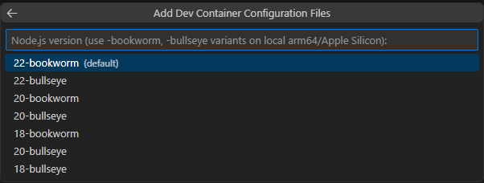
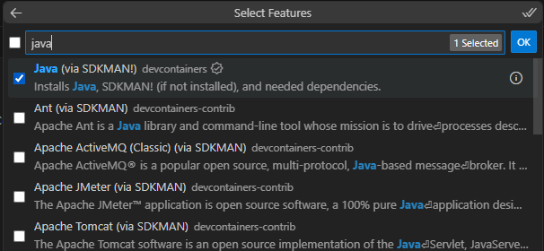
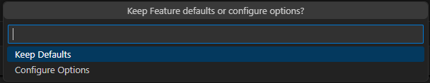
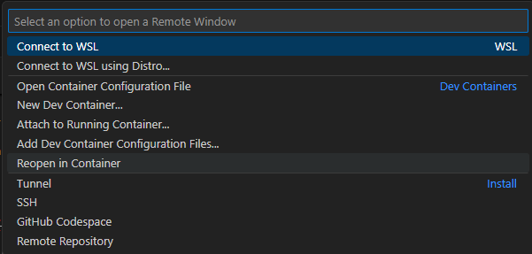
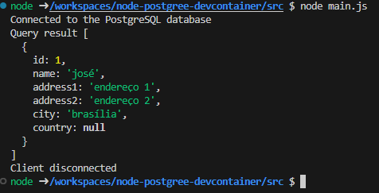
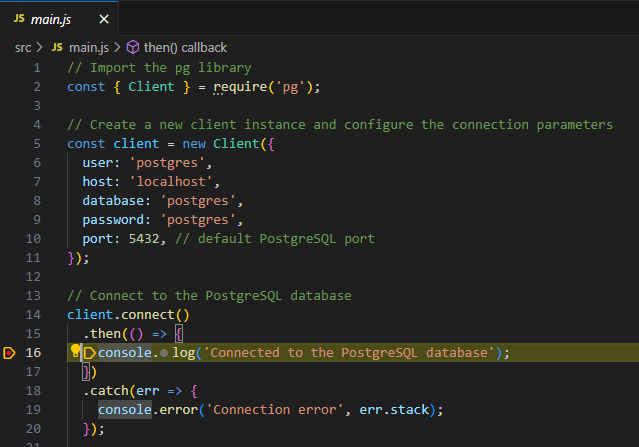

# Node PostgreSQL DevContainer Example

This repository is part of a presentation about DevContainers. Please check this repo as a starting point.

# What you will learn 

How to setup a dev environment with: 

- Node.Js
- PostgreSQL
- Liquebase 

# Repo structure
```
├── .devcontainer.backup -> If you follow the tutorial, but it's not working you can use this working devcontainer to
├── liquibase -> It uses liquebase to populate a PostgreSQL database
├── src -> It contains a testing code written in node.js
└── scripts -> It contains useful scripts 
```

# Setting up the devcontainer

Ensure you have `Docker`, `VSCode`, and `Dev Containers extension` installed.

Open the command palette and click `Add Dev Container Configuration Files`. This will start a wizard to create your `devcontainer.json` file.



Select `add configuration to workspace`. This will create the `devcontainer.json` inside your project allowing you to commit and share with others.


Now you need to choose the base image that your container will run. Here we will select `Node.js & PostgreSQL` since this sample will use these two tools.



Choose the node version that you want to use. Here we will keep the default one.



Now it's time to configure the features that we want to have installed in our container. As this sample uses liquebase to version the database we need to have `Java` installed on our container.



Now you can configure the features, in your case, we can configure the `Java` options. As this sample does not require any changes you can click on `Keep Defaults`



Done! Now you should have a `.devcontainer` folder in your project. 

Before running our container, we need to make some changes. First, we need to install the liquebase. Unfortunately, there is no feature to install liquebase, so we need to add some commands on our Dockerfile to install it. 

```Dockerfile
RUN wget -O- https://repo.liquibase.com/liquibase.asc | gpg --dearmor > liquibase-keyring.gpg
RUN cat liquibase-keyring.gpg | sudo tee /usr/share/keyrings/liquibase-keyring.gpg > /dev/null
RUN echo 'deb [arch=amd64 signed-by=/usr/share/keyrings/liquibase-keyring.gpg] https://repo.liquibase.com stable main' | sudo tee /etc/apt/sources.list.d/liquibase.list

RUN sudo apt-get update
RUN sudo apt-get install liquibase
```

Also, we want to execute the liquebase changes and run the npm install on our project when we create the container. To do it we will change the `devcontainer.json` and add the following line.

```
"postCreateCommand": "bash scripts/postCreateCommand.sh",
```

So every time that the container is created it will run this script finishing the container preparation.

Now you can start your container. You can open the `Command Palette` and click on `Reopen in Container`



After a few moments, your container will be available and ready to use. Now you can start programming, to test this you can run `node main.js` on the `src` folder. 

 

You can also debug normally by pressing `F5` on the `main.js` file.

